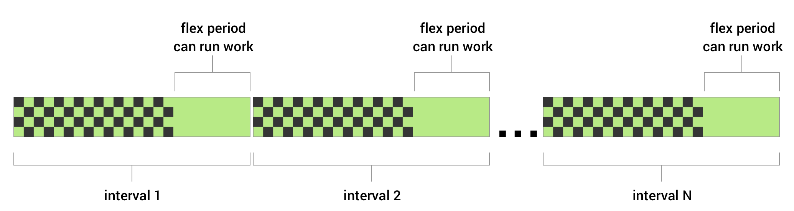
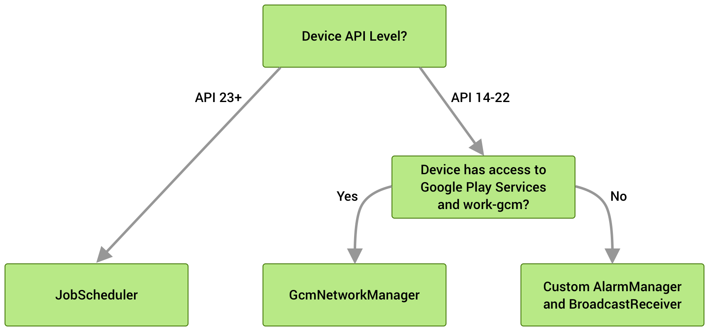
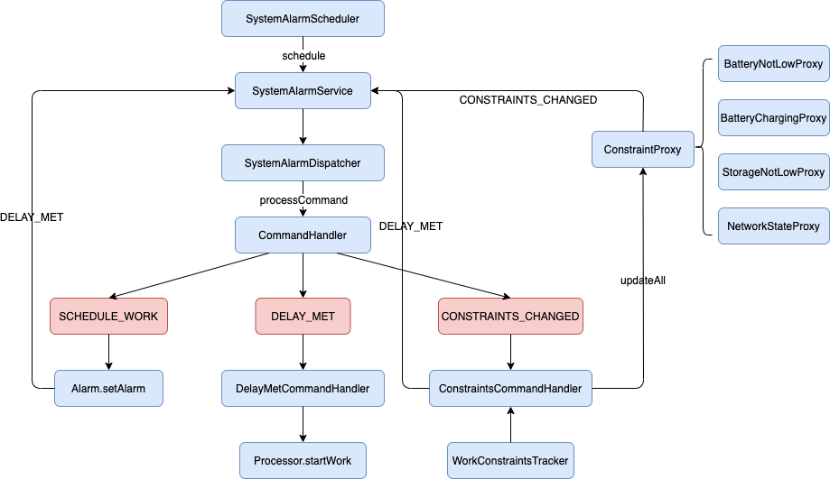

>WorkManager 是 Android Jetpack 的一个组件，主要用于管理调度**可延期异步**后台任务。它是一个适合用来替换先前的 Android 后台调度API（包括 FirebaseJobDispatcher、GcmNetworkManager 和 JobScheduler）的 Google 推荐的组件。WorkManager 在其现代、一致的 API 中整合了其前身的功能，该 API 支持 API 级别 14，在开发时即考虑到了对电池续航的影响。参考链接[1]。

## 1. 前言

WorkManager 统一了对于 Android 后台任务的管理。在此之前，从 6.0 开始 Google 引入了 Doze 机制，并且在之后的几个版本对 Android 的后台行为及广播的限制越来越严格。在 Android 8.0 时 Google 官方推荐开发者使用 JobScheduler 来代替 Service+Broadcast 的后台任务管理方式。为了兼容老版本，Android-Job，Firebase JobDispatcher 和 GCMNetworkManager 都曾是开发者的选择。2018年，Google推出的 jetpack 中包含了 WorkManager，之后android-job停止维Google官方为 Firebase JobDispatcher 和 GCMNetworkManager 提出了 WorkManager 的迁移方案（在Android 11 停用了Firebase JobDispatcher 和 GcmNetworkManager）。所以在一些场景中，使用 WorkManager 来维护我们的后台任务可以说是官方推荐的唯一方式。

WorkManager 适用于可延期工作，即不需要立即运行但需要可靠运行的工作，即使退出应用或重启设备也不影响工作的执行。例如：向后端服务发送日志或分析数据，定期将应用数据与服务器同步。它会帮助我们合理利用设备资源，避免不必要的内存，流量，电量等消耗，与之相对的限制就是，任务执行时间不会很精准，周期性任务的时间间隔规定不能小于15分钟（与 JobScheduler API一致）。

本文带着如下问题进行研究和探讨：WorkManager 是如何处理后台任务的？我们能否尝试解除其使用的限制，如去掉15分钟的限制？

本文主要包含三部分，第一部分介绍 WorkManager 的使用和部分源码解析；第二部分介绍 WorkManager 的 Scheduler，即调度任务的核心模块； 第三部分介绍如何通过Hook的手段去解除上述问题所述的限制。本文编辑时，WorkManager 的最新版本为 2.5.0，示例代码均使用Java语言。


## 2. WorkManager的使用及原理

### 2.1 简单使用

WorkManager 的使用十分简单，主要涉及三个类：**Worker 执行后台任务的工作抽象类**，需要继承它来执行自己的后台任务；**WorkRequest 任务请求的抽象类**，包含了任务执行的参数和条件，有现成的实现类，一次性任务 OneTimeWorkRequest ，和周期性任务 PeriodicWorkRequest，都可以使用Builder模式来创建，需要传入 Worker 的 class；**WorkManager 管理类**，单例创建，传入 WorkRequest 提交任务。
需要指出的是，任务执行还可以设置限制条件 **Constraints**，传入 WorkRequest。

```java
public class MyWorker extends Worker {
    public MyWorker(Context context, WorkerParameters workerParams) {
        super(context, workerParams);
    }
    @NonNull
    @Override
    public Result doWork() {
        // do work
        Log.d("ssc", "do work now");
        return Result.success();
    }
}
```

```java
public void submitWorker() {
        Constraints constraints = new Constraints.Builder()
                .setRequiredNetworkType(NetworkType.CONNECTED)  //联网状态
                .setRequiresBatteryNotLow(true)                 // 不在电量不足时执行
                .setRequiresCharging(true)                      // 在充电时执行
                .setRequiresStorageNotLow(true)                 // 不在存储容量不足时执行
                .setRequiresDeviceIdle(true)                    // 在待机状态下执行，需要 API 23
                .build();
		// 周期性任务
        WorkRequest request = new PeriodicWorkRequest.Builder(MyWorker.class,
                15, TimeUnit.MINUTES,     // 任务周期时间
                2, TimeUnit.MINUTES)			// 任务可容忍的执行时间范围
                .setConstraints(constraints)
                .build();
        // 一次性任务
        WorkRequest request = new OneTimeWorkRequest.Builder(MyWorker.class)
                .setInitialDelay(3, TimeUnit.MINUTES) // 设置任务延迟3分钟开始执行
                .addTag("Simple")  // 为任务添加标记位，方便统一取消
                .setBackoffCriteria(BackoffPolicy.EXPONENTIAL, 1, TimeUnit.MINUTES) // 表示任务失败后，会以延迟的方式执行重试
                .setConstraints(constraints)
                .build();

  			
        WorkManager.getInstance(context).enqueue(request);
}
```

### 2.2 高阶用法

定义工作 Worker 时，可以不继承 Worker，有如下几种模式可供选择：
- **Worker**：最简单的实现，WorkManager 会在后台线程上自动运行它。
- **CoroutineWorker**：为 Kotlin 用户建议的实现，提供了协程的支持。CoroutineWorker 针对后台工作公开挂起函数。默认情况下，它们运行默认的 Dispatcher。
- **RxWorker**：为 RxJava 用户建议的实现，如果有很多现有异步代码是用 RxJava 建模的建议使用。与所有 RxJava 概念一样，可以自由选择所需的线程处理策略。
- **ListenableWorker**：是 Worker、CoroutineWorker 和 RxWorker 的基类。这个类专为需要与基于回调的异步 API（例如 FusedLocationProviderClient）进行交互并且不使用 RxJava 的 Java 开发者而设计。
详情可参考官方文档（参考链接[2]）。

注意到上文**MyWorker**的代码中，doWork方法返回了 Result.success()，还可以返回 Result.failure() 和 Result.retry() 。如果是周期性任务，只有返回成功或失败才会进行下一次周期间隔的计时。另外，这些方法都可以传递 Data 类型的数据，作为数据输出；输入数据则是通过 WorkRequest 的 setInputData(Data) 方法传入，实现任务的数据交互。其重试是根据退避延迟时间和退避政策（BackoffPolicy）重新调度任务，参考链接[3]。

对于周期性任务 **PeriodicWorkRequest**，入参除了周期时间，还有一个 **flexInterval** 时间，它使得任务可以在一个时间段内灵活执行。从官方给出的解释图可以看出，这个flex时间小于等于周期时间，任务会在一个周期的最后flex时间段内执行。它的目的无疑是使得任务可以灵活避开一些系统繁忙或资源匮乏的时间点执行，但可以肯定的是，它是导致任务无法精确执行的一个因素。



对于**多任务**和**唯一任务**的管理，WorkManager 同样提供了相关 API。
多任务管理代码类似于：
```java
WorkManager.getInstance()
    // First, run all the A tasks (in parallel):
    .beginWith(workA1, workA2, workA3)
    // ...when all A tasks are finished, run the single B task:
    .then(workB)
    // ...then run the C tasks (in any order):
    .then(workC1, workC2)
    .enqueue()
```

除此之外，若多次提交同一个周期性任务，直接调用enqueue方法会导致越来越多的这个周期任务在系统里运行。此时我们希望只有一个我们需要的周期性任务，则需要调用**唯一任务**相关的方法。调用 enqueueUniquePeriodicWork 方法，对应的一次性任务则调用 enqueueUniqueWork 方法，指定唯一任务的name，以及替换规则：ExistingWorkPolicy.REPLACE，每次提交都替换新的任务配置和数据，有可能中止正在执行的任务；ExistingWorkPolicy.KEEP，每次都保持已有的任务配置和数据不做更改。

更多的用法请参考官方文档。用法介绍到这，接下来会分析源码流程。

### 2.3 初始化流程

了解一个框架，最好从初始化流程入手。初始化流程可以帮助我们了解该框架的基本架构和使用的一些默认资源。

使用时我们可以看到，WorkManager 是作为一个单例被调用，用于提交 WorkRequest 给系统调度。由于 WorkManager 是一个抽象类，我们需要看它的实现类 **WorkManagerImpl**，先看其单例方法，会涉及到一个 initialize 方法，从该方法的使用情况可以看到，有个 **WorkManagerInitializer** 类调用了这个初始化方法，它是个 ContentProvider，且它的作用仅仅是为了初始化 WorkManager，它使得单例对象在程序冷启动的时候已经被创建。初始化时创建了一个默认的 Configuration。Configuration 设置了许多属性，包括线程池、一些工厂类、Handler 以及一些标识性的ID名称等，用来管理和调度工作的方式。通常我们使用 WorkManager 默认创建的 Configuration 即可。
```java
public class WorkManagerInitializer extends ContentProvider {
    @Override
    public boolean onCreate() {
        // Initialize WorkManager with the default configuration.
        WorkManager.initialize(getContext(), new Configuration.Builder().build());
        return true;
    }
    // 省略了一些ContentProvider需要重写的方法，这些方法没有做任何事
    ...
}
```
在 initialize 方法中，我们看到调用了 WorkManagerImpl 的构造方法，新建了默认的 WorkManagerTaskExecutor 对象，用来执行 WorkManager 的任务。
```java
// WorkManagerImpl.java
public static void initialize(@NonNull Context context, @NonNull Configuration configuration) {
        synchronized (sLock) {
            ...
            if (sDelegatedInstance == null) {
                context = context.getApplicationContext();
                if (sDefaultInstance == null) {
                    sDefaultInstance = new WorkManagerImpl(context,                                   configuration,
                            new WorkManagerTaskExecutor(configuration.getTaskExecutor()));
                }
                sDelegatedInstance = sDefaultInstance;
            }
        }
    }
```
我们直接进入最终的构造方法的实现，比较重要的就是，createSchedulers() 用来根据 Build Version 创建不同的 Schedulers 进行任务调度，Processor 用来管理 Schedulers 的执行，和 internalInit() 真正的初始化。真正的初始化中，是一些赋值，以及开启一个 Runnable ，来处理可能的上一次任务异常中止或程序进程被杀的情况，来继续执行任务。其中还有一个 WorkDatabase，可以推测系统会将任务信息做数据持久化处理，保存在数据库中，执行时再取出具体数据。
```java
    // WorkManagerImpl.java
    public WorkManagerImpl(
            @NonNull Context context,
            @NonNull Configuration configuration,
            @NonNull TaskExecutor workTaskExecutor,
            @NonNull WorkDatabase database) {
        Context applicationContext = context.getApplicationContext();
        Logger.setLogger(new Logger.LogcatLogger(configuration.getMinimumLoggingLevel()));
        List<Scheduler> schedulers = createSchedulers(applicationContext, workTaskExecutor);
        Processor processor = new Processor(
                context,
                configuration,
                workTaskExecutor,
                database,
                schedulers);
        internalInit(context, configuration, workTaskExecutor, database, schedulers, processor);
    }
```
官方所说兼容不同API版本，选择不同后台方案的代码正是在 **createSchedulers()** 方法中。直接看官方示意图即可。API 大于或等于23，对应一个 SystemJobScheduler，否则，不支持Google服务则对应 SystemAlarmScheduler，GcmNetworkManager 则对应 GcmScheduler。除此之外，还有一个常驻的 Scheduler 为 GreedyScheduler，用于执行无约束条件的非周期性任务。



至此，初始化流程介绍完毕。小结一下，WorkManager 初始化时机在应用冷启动初始化 ContentProvider 时，主要涉及的类 Configuration 默认配置信息，TaskExecutor 线程调度，WorkDatabase 数据库存储，Scheduler 后台任务调度器，以及 Processor 控制开启或停止任务。

### 2.4 任务的提交和执行

我们调用 WorkManager 的 enqueue方法，及其他提交任务的方法后，最终都会调用到 **WorkContinuationImpl** 的 enqueue方法。WorkContinuationImpl 是 WorkContinuation 的实现类，这个类主要是为了能更好地整合多任务链的提交，以处理汇合不同任务链的场景，感兴趣的同学可自行去进一步研究。
```java
    // WorkContinuationImpl.java
    @Override
    public @NonNull Operation enqueue() {
        // Only enqueue if not already enqueued.
        if (!mEnqueued) {
            // The runnable walks the hierarchy of the continuations
            // and marks them enqueued using the markEnqueued() method, parent first.
            EnqueueRunnable runnable = new EnqueueRunnable(this);
            mWorkManagerImpl.getWorkTaskExecutor().executeOnBackgroundThread(runnable);
            mOperation = runnable.getOperation();
        } else {
            Logger.get().warning(TAG,
                    String.format("Already enqueued work ids (%s)", TextUtils.join(", ", mIds)));
        }
        return mOperation;
    }
```

这个方法会开启一个线程，后台运行 Enqueue 流程，我们直接看 EnqueueRunnable 的 run方法。

```java
    @Override
    public void run() {
        try {
            if (mWorkContinuation.hasCycles()) {
                throw new IllegalStateException(
                        String.format("WorkContinuation has cycles (%s)", mWorkContinuation));
            }
            boolean needsScheduling = addToDatabase();
            if (needsScheduling) {
                // Enable RescheduleReceiver, only when there are Worker's that need scheduling.
                final Context context =
                        mWorkContinuation.getWorkManagerImpl().getApplicationContext();
                PackageManagerHelper.setComponentEnabled(context, RescheduleReceiver.class, true);
                scheduleWorkInBackground();
            }
            mOperation.setState(Operation.SUCCESS);
        } catch (Throwable exception) {
            mOperation.setState(new Operation.State.FAILURE(exception));
        }
    }
```

这里比较重要的两个方法，一个是 addToDatabase()，会把任务相关数据存入数据库，另一个是 scheduleWorkInBackground()，将任务交给初始化传入的 Scheduler 进行调度。scheduleWorkInBackground() 方法会调用 Schedulers 的 schedule() 方法，在这里会从数据库读取 **WorkSpec** 数据结构，即任务相关的所有信息，官方此处采用了 Room 框架管理数据库。然后通过 Scheduler 的 schedule() 方法将数据传给各个 Scheduler。这里实现了 Scheduler 接口的类为：GreedyScheduler、SystemJobScheduler 和 SystemAlarmScheduler。GreedyScheduler 专门处理无约束的一次性任务，其他的任务根据 API 版本，分别使用 SystemJobScheduler 和 SystemAlarmScheduler，可参考上一小节的版本使用策略。

另外，PackageManagerHelper.setComponentEnabled() 开启了 RescheduleReceiver，监听了开机，时间变化和时区变化三个广播。

Scheduler 由于持有了 WorkManager 的实例，即 WorkManagerImpl 实例，在需要开始执行任务时，会调用 WorkManagerImpl 的 startWork 方法。执行时机的调度具体在下文介绍。WorkManager 会开启**StartWorkRunnable**后台运行，最终调用 WorkManagerImpl 初始化时创建的 Processor 的 startWork 方法，源码如下：
```java
    // Processor.java
    /**
     * Starts a given unit of work in the background.
     *
     * @param id The work id to execute.
     * @param runtimeExtras The {@link WorkerParameters.RuntimeExtras} for this work, if any.
     * @return {@code true} if the work was successfully enqueued for processing
     */
    public boolean startWork(
            @NonNull String id,
            @Nullable WorkerParameters.RuntimeExtras runtimeExtras) {

        WorkerWrapper workWrapper;
        synchronized (mLock) {
            // Work may get triggered multiple times if they have passing constraints
            // and new work with those constraints are added.
            if (isEnqueued(id)) {
                Logger.get().debug(
                        TAG,
                        String.format("Work %s is already enqueued for processing", id));
                return false;
            }

            workWrapper =
                    new WorkerWrapper.Builder(
                            mAppContext,
                            mConfiguration,
                            mWorkTaskExecutor,
                            this,
                            mWorkDatabase,
                            id)
                            .withSchedulers(mSchedulers)
                            .withRuntimeExtras(runtimeExtras)
                            .build();
            ListenableFuture<Boolean> future = workWrapper.getFuture();
            future.addListener(
                    new FutureListener(this, id, future),
                    mWorkTaskExecutor.getMainThreadExecutor());
            mEnqueuedWorkMap.put(id, workWrapper);
        }
        mWorkTaskExecutor.getBackgroundExecutor().execute(workWrapper);
        return true;
    }
```
方法中创建了一个 **WorkerWrapper**，WorkerWrapper 是一个 Runnable 对象，正是这个类把将上述所有流程与我们继承的 Worker 联系起来，名字上是 Worker 的包装类。WorkerWrapper的 run() 方法的相关实现，省略了部分源码：
```java
    // WorkerWrapper.java
    @WorkerThread
    @Override
    public void run() {
        mTags = mWorkTagDao.getTagsForWorkSpecId(mWorkSpecId);
        mWorkDescription = createWorkDescription(mTags);
        runWorker();
    }

    private void runWorker() {
        if (tryCheckForInterruptionAndResolve()) {
            return;
        }

        mWorkDatabase.beginTransaction();
        try {
            mWorkSpec = mWorkSpecDao.getWorkSpec(mWorkSpecId);
            ...
            mWorkDatabase.setTransactionSuccessful();
        } finally {
            mWorkDatabase.endTransaction();
        }

        // Merge inputs.  This can be potentially expensive code, so this should not be done inside
        // a database transaction.
        Data input;
        // init input
        ...

        WorkerParameters params = new WorkerParameters(
                UUID.fromString(mWorkSpecId),
                input,
                mTags,
                mRuntimeExtras,
                mWorkSpec.runAttemptCount,
                mConfiguration.getExecutor(),
                mWorkTaskExecutor,
                mConfiguration.getWorkerFactory(),
                new WorkProgressUpdater(mWorkDatabase, mWorkTaskExecutor),
                new WorkForegroundUpdater(mWorkDatabase, mForegroundProcessor, mWorkTaskExecutor));

        // Not always creating a worker here, as the WorkerWrapper.Builder can set a worker override
        // in test mode.
        if (mWorker == null) {
            mWorker = mConfiguration.getWorkerFactory().createWorkerWithDefaultFallback(
                    mAppContext,
                    mWorkSpec.workerClassName,
                    params);
        }
        ...

        // Try to set the work to the running state.  Note that this may fail because another thread
        // may have modified the DB since we checked last at the top of this function.
        if (trySetRunning()) {
            if (tryCheckForInterruptionAndResolve()) {
                return;
            }

            final SettableFuture<ListenableWorker.Result> future = SettableFuture.create();
            // Call mWorker.startWork() on the main thread.
            mWorkTaskExecutor.getMainThreadExecutor()
                    .execute(new Runnable() {
                        @Override
                        public void run() {
                            try {
                                mInnerFuture = mWorker.startWork();
                                future.setFuture(mInnerFuture);
                            } catch (Throwable e) {
                                future.setException(e);
                            }

                        }
                    });

            // Avoid synthetic accessors.
            final String workDescription = mWorkDescription;
            future.addListener(new Runnable() {
                @Override
                @SuppressLint("SyntheticAccessor")
                public void run() {
                    try {
                        // If the ListenableWorker returns a null result treat it as a failure.
                        ListenableWorker.Result result = future.get();
                        if (result == null) {
                            Logger.get().error(TAG, String.format(
                                    "%s returned a null result. Treating it as a failure.",
                                    mWorkSpec.workerClassName));
                        } else {
                            ...
                            mResult = result;
                        }
                    } catch(Exception e) {
                        ...
                    } finally {
                        onWorkFinished();
                    }
                }
            }, mWorkTaskExecutor.getBackgroundExecutor());
        } else {
            resolveIncorrectStatus();
        }
    }
```
这段代码很长，首先根据任务ID从数据库读取任务的信息，随后构造了一个 **WorkerParameters** 实例，这里 Data 类型的 input 就是任务的输入参数，我们可以在 WorkRequest 设置， WorkerParameters 正是我们继承 Worker 类的构造方法需要传入的参数之一。然后调用 mConfiguration.getWorkerFactory().createWorkerWithDefaultFallback() 方法创建 Worker 对象，这个方法里面正是利用我们传入的继承 Worker 类的 class ，通过反射创建了 Worker 对象，这里不作展开。之后交由 WorkTaskExecutor 调度处理。在 run() 方法的实现，我们看到调用了 mWorker.startWork() 方法，这是 ListenableWorker 的抽象方法，我们可以自己继承 ListenableWorker 实现，Worker 的默认实现封装了返回结果的实现，并暴露了抽象方法 doWork() 方法让继承者实现。接下来就是对返回结果的处理，关键方法是 onWorkFinished()，将会更新任务状态和结果到数据库中，如果成功或失败，则针对周期性任务要开启下一个周期的任务；如果需要重试，则开启重试流程，在这里我们不再做进一步展开。

至此，WorkManager 的任务提交和执行流程就简要地介绍完毕了。小结一下，WorkManager 的enqueue 方法，会新建 WorkContinuation 实例并调用其 enqueue 方法，运行 EnqueueRunnable，先将任务信息存入数据库，如果需要则立即调度执行任务，否则让 Scheduler自己决定何时执行任务；任务执行会调用 WorkManager 的 startWork 方法，进一步调用 Processor 的 startWork 方法，创建了 WorkerWrapper 来包装管理任务的执行，包括任务数据的传入和传出，以及处理任务执行的结果。

### 2.5 小结

我们可以知道，控制任务何时执行的核心模块在于 Scheduler，我们放到下一章介绍。另外，我们可以思考 WorkManager 是如何保证任务执行的可靠性的。关键点在于利用数据持久化，将任务存入本地数据库，保证即使程序重启或设备重启也能拿到任务数据；其次，它维护了一套任务状态的流转，也保存在数据库中，程序任何时候去读取数据库，也能根据任务状态**（WorkInfo.State）**继续执行任务（只要任务不处在终态：SUCCEEDED、FAILED 或 CANCELLED）。我们还可以注意到，由于任务的执行还是放在后台线程中，在程序退出后任务还是有可能被系统中止，虽然下次打开程序还可以继续执行，但有时候我们希望长时间任务可以一直在后台执行不被中止，官方同样给予了支持，详见参考链接[4]。

## 3. Scheduler调度

上一个章节介绍了 WorkManager 的一些主要流程，本章介绍 Scheduler 的具体调度。这里会介绍 Scheduler 的三个实现类，GreedyScheduler、SystemJobScheduler 和 SystemAlarmScheduler，GreedyScheduler主要处理无限制的一次性任务，SystemJobScheduler 和 SystemAlarmScheduler 则是处理其他的任务类型，区别在于使用在不同的 Android 版本。
从上文我们知道，Scheduler 的调用从 schedule() 方法开始，最终调用 Processor 的 startWork 方法就回调了我们自定义的任务内容，我们仅讨论这里面的流程。

### 3.1 GreedyScheduler

GreedyScheduler 的实现十分清晰明了，它的 schedule 方法的实现可以简化成以下流程：


可以看出，它处理延时任务的原理还是使用了主线程 Handler 的 postDelay 方法。对于有约束的情况，会涉及到 **WorkConstraintsTracker** 这个类（构造方法如下），他维护了一些状态控制器 **ConstraintController**，控制器记录了当前的状态值，在状态变化时回调 Scheduler 去判断是否满足约束条件，若满足就执行 WorkManagerImpl.startWork 直接执行任务。而每个 ConstraintController 都有各自对应的 **ConstraintTracker** ，它主要通过监听系统广播，来告知 ConstraintController 状态变化，如网络状态变化**NetworkStateTracker**、充电状态变化**BatteryChargingTracker**等。
```java
    // WorkConstraintsTracker.java
    public WorkConstraintsTracker(
            @NonNull Context context,
            @NonNull TaskExecutor taskExecutor,
            @Nullable WorkConstraintsCallback callback) {

        Context appContext = context.getApplicationContext();
        mCallback = callback;
        mConstraintControllers = new ConstraintController[] {
                new BatteryChargingController(appContext, taskExecutor),
                new BatteryNotLowController(appContext, taskExecutor),
                new StorageNotLowController(appContext, taskExecutor),
                new NetworkConnectedController(appContext, taskExecutor),
                new NetworkUnmeteredController(appContext, taskExecutor),
                new NetworkNotRoamingController(appContext, taskExecutor),
                new NetworkMeteredController(appContext, taskExecutor)
        };
        mLock = new Object();
    }
```

### 3.2 SystemAlarmScheduler

SystemAlarmScheduler 的相关源码比较绕，整理成下面的流程图会比较清晰：



SystemAlarmScheduler 调用 schedule 方法后，是打开了 **SystemAlarmService**，传入ACTION_SCHEDULE_WORK，及任务ID。SystemAlarmService 是一个 Service，它的 onStartCommand 方法是将 intent 交给 **SystemAlarmDispatcher** 处理，实际上是 **CommandHandler** 的 onHandleIntent 方法来处理各种 action。

这里列出了最主要的三种 Action：
1. SCHEDULE_WORK 是编排任务，会根据任务ID从数据库中取出任务数据，然后计算它需要何时执行或周期任务的下一次执行时间，接着调用 Alarm 的 setAlarm 方法设置延时，Alarm 的内部就是使用 AlarmManager 实现的，在执行时则是开启服务 SystemAlarmService，传入 ACTION_DELAY_MET。
2. 那么就会走到第二种 Action 的处理流程，DELAY_MET 就是到达任务执行时刻，经由 DelayMetCommandHandler 处理，最终调用Processor 的 startWork方法，执行我们的任务。
3. 第三种 Action，CONSTRAINTS_CHANGED 是约束状态改变时的处理流程。这里是经由 ConstraintsCommandHandler 来处理，它也维护了一个 WorkConstraintsTracker，如我们上一节所述，它可以记录约束状态的值，由于在 ConstraintsCommandHandler 初始化 WorkConstraintsTracker 时没有设置回调，所以 WorkConstraintsTracker 的作用仅仅是判断是否符合约束条件。判断符合约束条件时，会开启服务 SystemAlarmService，传入 ACTION_DELAY_MET，进入第二种 Action 的处理流程。真正监听约束状态变化的是 ConstraintProxy，它本质是一个 Broadcast，监听系统广播，监听到特定广播后，则开启服务 SystemAlarmService，传入 CONSTRAINTS_CHANGED。

### 3.3 SystemJobScheduler

SystemJobScheduler 实际上就是官方自己使用了 JobScheduler 的相关API，来实现任务的调度。JobScheduler 不在本文的范围，它的实现原理就不展开讲了，下面简单介绍一下它的使用。

首先需要继承 JobService，来执行我们的任务，他的本质是一个 Service：
```java
public class MyJobService extends JobService {
    @Override
    public boolean onStartJob(JobParameters params) {
        // do our works
        Executor.execute(runnnable);
        return true;
    }

    @Override
    public boolean onStopJob(JobParameters params) {
        return false;
    }
}
```

当任务开始时会执行 onStartJob 方法，这个方法返回一个boolean值。如果返回值是 false，系统假设这个方法返回时任务已经执行完毕。如果返回值是 true，那么系统假定这个任务正要被执行。当任务执行完毕时你需要调用 jobFinished 来通知系统。

当系统接收到一个取消请求时，系统会调用 onStopJob 方法取消正在等待执行的任务。很重要的一点是如果 onStartJob 返回 false，那么系统假定在接收到一个取消请求时已经没有正在运行的任务。换句话说，onStopJob 在这种情况下不会被调用。需要注意的是这两个方法都运行在主线程。

JobScheduler 是一个系统服务，调用时需传入参数 JobInfo，这个参数包含了我们任务的所有配置信息。

```java
JobScheduler jobScheduler = (JobScheduler) context.getSystemService(Context.JOB_SCHEDULER_SERVICE);

ComponentName componentName = new ComponentName(context, MyJobService.class); // 设置我们的JobService
JobInfo job = new JobInfo.Builder(jobId, componentName)
        .setMinimumLatency(5000) //最小延时 5秒
        .setOverrideDeadline(60000) // 最多执行时间
        .setRequiredNetworkType(JobInfo.NETWORK_TYPE_ANY)// 任意网络
         // 设置重试/退避策略，当一个任务调度失败的时候执行什么样的测量采取重试。
         // initialBackoffMillis: 第一次尝试重试的等待时间间隔ms
         // backoffPolicy: 对应的退避策略。比如等待的间隔呈指数增长，或线性增长
         .setBackoffCriteria(initialBackoffMillis, backoffPolicy)
         .setBackoffCriteria(JobInfo.MAX_BACKOFF_DELAY_MILLIS, JobInfo.BACKOFF_POLICY_LINEAR)
         .setPeriodic(intervalMillis)// 设置执行周期，每隔一段时间间隔任务最多可以执行一次。
         .setPeriodic(intervalMillis, flexMillis)// 在周期执行的末端有一个flexMillis长度的任务执行窗口期。
         // 设置设备重启后，这个任务是否还要保留。需要权限：RECEIVE_BOOT_COMPLETED
         .setPersisted(isPersisted)
         .setRequiresCharging(true)// 是否需要充电
         .setRequiresDeviceIdle(true)// 是否需要等设备出于空闲状态的时候
         .addTriggerContentUri(uri)// 监听uri对应的数据发生改变，就会触发任务的执行。
         .setTriggerContentMaxDelay(duration)// 设置Content发生变化一直到任务被执行中间的最大延迟时间
         //设置Content发生变化一直到任务被执行中间的延迟。如果在这个延迟时间内content发生了改变，延迟时间会重写计算。
         .setTriggerContentUpdateDelay(durationMilimms)
         .build();
//调用schedule
jobScheduler.schedule(job);
```
使用方式的相关代码如上所列。整个源码看下来，它的实现原理也没有太多新花样。它开启了一个系统服务 JobScheduler 在系统进程保证所有任务的调度，进程间通信利用了Binder，它与我们自己实现的 Service 通过一个 JobServiceContext 联系起来，JobServiceContext 的本质是一个 ServiceConnection。进程内延时的实现用的是 Handler 的延时消息。对于任务的相关信息，JobScheduler 也用到了数据持久化，是存到了 xml 文件中，而非数据库。另外，对于约束条件的控制，同样用到了对系统各种广播的监听。

我们回到 WorkManager 的介绍中。SystemJobScheduler 的 schedule 方法可以简化成如下伪代码：
```java
JobScheduler jobScheduler = (JobScheduler) context.getSystemService(Context.JOB_SCHEDULER_SERVICE);
@Override
public void schedule(@NonNull WorkSpec... workSpecs) {
    for (WorkSpec workSpec : workSpecs) {
        JobInfo jobInfo = SystemJobInfoConverter.convert(workSpec);
        jobScheduler.schedule(jobInfo);
    }
}
```

主要是用一个工具类把 WorkManager 的任务配置数据类型 WorkSpec，转化为 JobScheduler 的数据类型 JobInfo，然后直接调用 JobScheduler 的 schedule 方法。我们从 **SystemJobInfoConverter** 可以查看数据类型转换的所有细节，源码先不展开讨论，对应于需要传入继承 JobService 的地方，它传入的是 **SystemJobService**，这就是官方实现的对 JobService 的继承，用来执行任务。在 onStartJob 方法中我们发现了 mWorkManagerImpl.startWork 方法的调用，任务执行完毕后，利用回调 ExecutionListener.onExecuted 最后调用了 jobFinished 方法。

### 3.4 小结

三种 Scheduler 的实现原理我们介绍完毕，我们有两个关注的重点，一是对延时的处理，为了保证计时不被程序退出等原因所影响，必须做到计时任务不局限于应用程序内，官方的思路是借助系统服务，SystemAlarmScheduler 利用了 AlarmManager，SystemJobScheduler 利用了 JobSchedulerService。另一个重点是对约束条件的管理，约束条件包括网络状况要求、充电状态的要求、电量要求、内存要求、设备空闲要求以及程序空闲要求等，官方在所有版本都是利用了监听系统广播的方法，观测各种状态的变化。在状态变化时，去判断是否满足约束条件，判断满足执行时间，都满足则执行任务。

至此，我们应该已经了解 WorkManager 如何处理后台任务了，接下来，我们可以思考并尝试如何解除 WorkManager 的使用限制了。

## 4. Hook实践

本章我们尝试使用 Hook 的技术解除 WorkManager 的使用限制，即周期性任务时间的限制。上文介绍了全流程，本章只需要深入研究时间设置的相关代码就能找到突破口。

### 4.1 Hook 技术简介

这里只讨论 Android 范畴内的 Hook 技术，它用于绕过系统限制、修改别人发布的代码、动态化、调用隐藏API、插件化、组件化、自动化测试、沙箱等等。一两篇文章是不可能将这个技术完整地介绍清楚的。

Hook 技术的实现原理有很多，最基础的且技术门槛最低的就是利用 Java 的反射和动态代理，但这种方式适用范围十分有限。也可以通过注入字节码，修改ClassLoader加载类的顺序，甚至修改虚拟机对函数的映射，来实现 Hook，这种方法的适用范围就可以覆盖到所有 Java 层的代码了。若还需要 Hook Native 层，则可以使用 GOT/PLT Hook，Inline Hook 以及 Trap Hook 等。

通常除了简单的使用场景我们可以自己用反射或动态代理实现 Hook，其他场景通常可以使用一些业内的 Hook 技术框架来实现。Hook 技术框架，有比较著名的 Xposed 框架及其衍生框架，如 VirtualXposed、dexposed等，还有 Cydia Substrate 框架，Frida 框架，YAHFA 框架，EPIC 框架等等。

### 4.2 WorkManager 的 Hook 点研究

要寻找 Hook 的切入点，我们必须研究周期性任务的时间间隔设置过程，以及执行过程。

周期性任务的时间设置从 PeriodicWorkRequest.Builder 的构造方法开始，会直接设置到一个成员变量 mWorkSpec 中，该成员变量就是 WorkManager 的任务数据结构类型 WorkSpec，记录了所有任务的配置数据。我们具体看 WorkSpec 设置周期性时间间隔的源码（省略了日志打印相关的代码）：
```java
    // WorkSpec.java
    public void setPeriodic(long intervalDuration) {
        if (intervalDuration < MIN_PERIODIC_INTERVAL_MILLIS) {
            intervalDuration = MIN_PERIODIC_INTERVAL_MILLIS;
        }
        setPeriodic(intervalDuration, intervalDuration);
    }

    public void setPeriodic(long intervalDuration, long flexDuration) {
        if (intervalDuration < MIN_PERIODIC_INTERVAL_MILLIS) {
            intervalDuration = MIN_PERIODIC_INTERVAL_MILLIS;
        }
        if (flexDuration < MIN_PERIODIC_FLEX_MILLIS) {
            flexDuration = MIN_PERIODIC_FLEX_MILLIS;
        }
        if (flexDuration > intervalDuration) {
            flexDuration = intervalDuration;
        }
        this.intervalDuration = intervalDuration;
        this.flexDuration = flexDuration;
    }
```
我们马上就看到了这个限制时间 MIN_PERIODIC_FLEX_MILLIS，正是15分钟。设置的时间间隔小于15分钟则直接设置成15分钟，另外，执行时间范围 flexDuration 必须小于或等于这个时间间隔。

这个 mWorkSpec 最后被存到数据库中，在需要执行时从数据库取出，我们分别查看三种 Scheduler 对这个时间参数的使用。我们分别在 DelayedWorkTracker（对应 GreedyScheduler），CommandHandler（对应 SystemAlarmScheduler）和 SystemJobInfoConverter（对应 SystemJobScheduler） 类中发现了 **WorkSpec.calculateNextRunTime** 方法的调用，intervalDuration 的使用也仅出现在 calculateNextRunTime 这个方法中。也就是说，三种 Scheduler 都是通过 calculateNextRunTime 使用这个周期时间间隔参数的。从源码中看来，这方法里面并没有对该时间的使用做任何限制。

紧接着，DelayedWorkTracker 拿到该方法的返回值后，直接设置给 Handler.postDelayed 方法；CommandHandler 拿到该方法的返回值后，设置到 Alarms.setAlarm 方法中供 AlarmManager 使用；SystemJobInfoConverter，则是将 WorkSpec 的值转化成 JobInfo，再设置给JobScheduler。三种 Scheduler 的处理唯一有可能做限制的，就是 SystemJobInfoConverter，我们查看其关键方法 convert 的源码：
```java
    // SystemJobInfoConverter.java
    JobInfo convert(WorkSpec workSpec, int jobId) {
        Constraints constraints = workSpec.constraints;
        int jobInfoNetworkType = convertNetworkType(constraints.getRequiredNetworkType());
        PersistableBundle extras = new PersistableBundle();
        extras.putString(EXTRA_WORK_SPEC_ID, workSpec.id);
        extras.putBoolean(EXTRA_IS_PERIODIC, workSpec.isPeriodic());
        JobInfo.Builder builder = new JobInfo.Builder(jobId, mWorkServiceComponent)
                .setRequiredNetworkType(jobInfoNetworkType)
                .setRequiresCharging(constraints.requiresCharging())
                .setRequiresDeviceIdle(constraints.requiresDeviceIdle())
                .setExtras(extras);

        long nextRunTime = workSpec.calculateNextRunTime();
        long now = System.currentTimeMillis();
        long offset = Math.max(nextRunTime - now, 0);

        builder.setMinimumLatency(offset);
        ...
        return builder.build();
    }
```
这里省略了一些无关代码。我们发现它并没有调用 JobInfo 的 setPeriodic 方法设置周期间隔，而是调用了 setMinimumLatency 方法设置了一个执行延时。这其实是跟 WorkManager 处理周期性任务的整体策略是一致的，**对于周期性任务，WorkManager 会当作延时任务处理，在执行完毕后判断是周期性任务，则不会将任务置为终态，而是设置下一个延时任务**。也就是说，它并没有使用 JobScheduler 处理周期性任务的机制，所以这里也没有对周期时间做任何限制。

综上所述，WorkManager 对于周期时间的限制仅仅在 WorkSpec.setPeriodic 方法中。Hook 的思路有很多，最直接的 Hook 这个方法是可行的，但由于这不是一个接口的方法，无法使用动态代理，可能需要借助三方框架。更简单的办法是跳过这个 set 方法直接修改其成员变量的值，这就需要在运行时，创建 WorkRequest 对象后，enqueue 到 WorkManager 之前，针对 WorkRequest 对象进行 Hook，利用简单的反射即可实现。

### 4.3 Hook 实践结果

根据上一节的思路，我们修改2.1节的示例代码：
```java
PeriodicWorkRequest request = new PeriodicWorkRequest.Builder(MyWorker.class,
                time, unit) // 这里设置的时间将被Hook修改，可随意填写
                .setConstraints(constraints)
                .build();
        // 在此处Hook
        HookWorkManagerUtil.hook(request);

        workManager.enqueueUniquePeriodicWork("net_diagnosis_upload",
                ExistingPeriodicWorkPolicy.REPLACE, request);
                
// HookWorkManagerUtil.java
public static void hook(WorkRequest request) {
        long interval = 1000L; // 真正设置的周期时间间隔，单位ms
        try {
            // 获取 WorkRequest 的成员变量 mWorkSpec
            Field workSpec = WorkRequest.class.getDeclaredField("mWorkSpec");
            workSpec.setAccessible(true);
            WorkSpec mWorkSpec = (WorkSpec) workSpec.get(request);

            // 直接修改 mWorkSpec 的 intervalDuration
            Field intervalDuration = WorkSpec.class.getDeclaredField("intervalDuration");
            intervalDuration.setAccessible(true);
            intervalDuration.set(mWorkSpec, interval);

        } catch (NoSuchFieldException | IllegalAccessException e) {
            e.printStackTrace();
        }
    }
```
这样就能把任务的周期设置为1秒，运行后从 Logcat 中可以看到我们执行任务打出的 Log 以及执行时间。


我们发现每次任务的时间间隔都会多出来 20ms 左右的时间，可能根据设备情况有不同的时间差异，我们知道 WorkManager 在处理周期性任务时，会在一次任务执行完毕后再根据情况设置下一个周期任务的延时，所以周期时间不会是精准的。具体的耗时行为我们可以从 WorkerWrapper 的源码来推测，从任务执行完成获得返回结果，到 resetPeriodicAndResolve() 方法以当前时间为准来设置下一个周期的执行时间，这之间都是一些数据库操作，修改状态，删除任务进度的数据等，所以可以推断这 20ms 的时间都耗费在了数据库操作里。利用System Trace可以很容易证实我们的推论。

我们可以思考如何把时间偏差进一步优化。比如记录任务执行完成的时间，而不是以当前时间为准来设置下一个周期开始时间。考虑到多个任务异步执行的情况，可以在任务执行完成的返回结果中默认加入一个完成时间的参数。但这个优化就没法简单地用Hook实现了。

至此，我们成功地 Hook 了 WorkManager，解除了15分钟的限制。Hook 的操作如此简单只是个偶然，Hook 实践真正的难点在于源码的研究和 Hook 点的确定过程。

作为一个扩展，如果要解除 JobScheduler 的15分钟限制，这里也给出一个思路。15分钟的限制常量位于 JobInfo 类中，值得庆幸的是常量的调用都使用了一个静态方法 JobInfo.getMinPeriodMillis 直接返回常量值，所以只需要 Hook 这个静态方法，让它始终返回 0 就能解除时间限制。Hook 点只有一个，但 Hook 静态方法就不能用简单的反射和动态代理了，此时就可以借助第三方 Hook 框架来实现了。

## 5. 总结

本文介绍了 Android  Jetpack 的组件 WorkManager。介绍了它的使用方法，如何设置后台一次性任务或者周期性任务，如何设置任务的约束条件等。随后分析了其核心源码，了解了初始化，和基于 Scheduler 和数据持久化的任务执行流程。对于核心模块涉及的三种 Scheduler，介绍了它们调度任务的策略，如何延时，以及通过系统广播判断约束条件的变化。

除此之外，针对 WorkManager 使用上的限制，周期性任务的时间间隔必须大于或等于15分钟，这是延续了 JobScheduler 的限制，官方没有给出这么做的原因。作为思考和扩展实践，我们利用 Hook 技术成功跳过了此限制，使得我们能够更灵活地使用 WorkManager。

## 参考链接
- [1] [https://developer.android.google.cn/topic/libraries/architecture/workmanager](https://developer.android.google.cn/topic/libraries/architecture/workmanager)
- [2] [https://developer.android.google.cn/topic/libraries/architecture/workmanager/advanced/threading](https://developer.android.google.cn/topic/libraries/architecture/workmanager/advanced/threading)
- [3] [https://developer.android.google.cn/topic/libraries/architecture/workmanager/how-to/define-work](https://developer.android.google.cn/topic/libraries/architecture/workmanager/how-to/define-work)
- [4] [https://developer.android.google.cn/topic/libraries/architecture/workmanager/advanced/long-running](https://developer.android.google.cn/topic/libraries/architecture/workmanager/advanced/long-running)